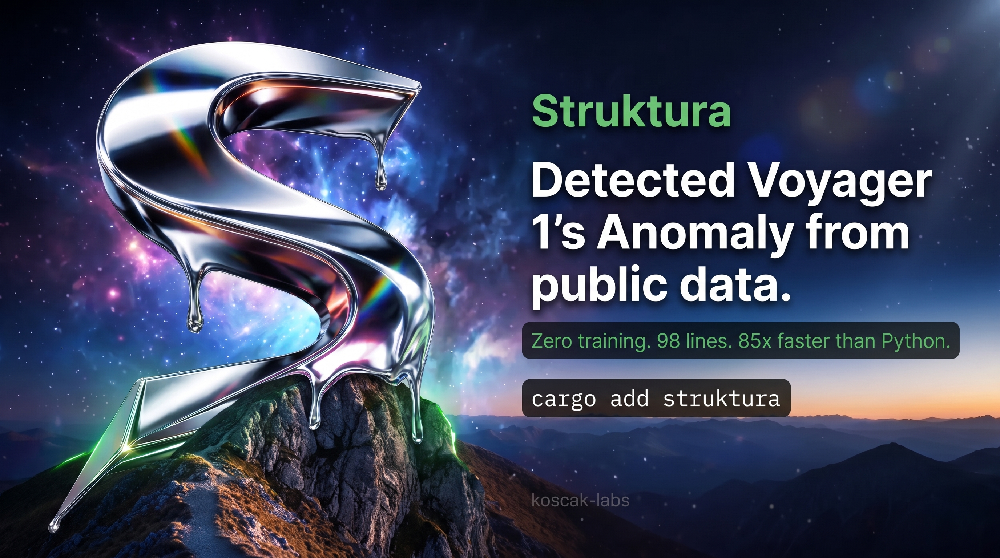

<p align="center">
  
</p>

<p align="center">
  <a href="https://crates.io/crates/struktura"></a>
  <a href="https://github.com/koscak-labs/struktura/actions/workflows/ci.yml"></a>
  <a href="https://github.com/koscak-labs/struktura"></a>
  <a href="https://docs.rs/struktura"></a>
  <a href="https://docs.rs/struktura"></a>
</p>

---

anomaly detection that actually works. not thresholds. not ML. not vibes.

**[try it in your browser →](https://koscak-labs.github.io/struktura/playground/)** no install needed.

DFA (Detrended Fluctuation Analysis) gives you one number that tells you if a signal's structure changed. works on literally anything with a time axis. spacecraft, bearings, financial data, heartbeats, DNA, text rhythm. you name it.

```
cargo install struktura
struktura demo              # 🔧 bearing fault detection (real CWRU data)
struktura voyager           # 🚀 Voyager 1 AACS anomaly (real NASA data)
struktura spacecraft        # 🛰️ multi-channel spacecraft health
struktura text novel.txt    # 📖 writing rhythm analysis
```

## 🚀 10 second demo

```
$ struktura voyager

  VOYAGER 1 STRUCTURAL HEALTH ANALYSIS
  ====================================================================

  2021 (healthy)    alpha=0.989  R²=0.9869
  2022 (anomaly)    alpha=0.801  R²=0.9681
                    shift=-0.187  CRITICAL

  the magnetic field's fractal structure changed during the anomaly.
  detectable from public NASA data, zero training, zero ML.
```

real data. real spacecraft. one rust function caught it. 🎯

## 🤖 it flies missions autonomously

`struktura mission` — 24,000 samples, three scripted disasters, zero human calls:

```
t=  4004  ALARM        RepeatedValue on temp (class: stuck)
t=  4004  QUARANTINE   temp declared dead -> virtual mode
t= 10069  ALARM        LevelShift on pointing (class: regime_shift)
t= 10769  RECALIBRATED guard passed -> new normal accepted
t= 19173  ALARM        LevelShift on soc (class: drift_confirmed)
```

dead sensor? quarantined in 4 samples, its reading reconstructed from the
other channels' physics (R² > 0.9). environment permanently changed? it
re-learns "normal" through a guarded candidate — and rolls back if the new
regime is actually a fault trying to sneak in. drift disguised as a regime
change? refused. every decision above was made by the monitor alone.

## 🧬 it evolved its own detectors

`struktura evolve` — an adversarial RED/BLUE loop: RED invents faults the
monitor misses, BLUE synthesizes new detector legs from a grammar, accepted
only with ZERO false alarms on clean data:

| generation | fault coverage | detector legs |
|---|---|---|
| 1 | 71% | 2 |
| 4 | 89% | 5 |
| 9 | **97%** | 6 |

the machine independently invented variance monitors, residual-trend
monitors, and derivative-volatility monitors — detector classes nobody
hand-coded. parameter tuning alone plateaued at 75%; structural synthesis
broke through.

## 🛡️ the receipts

- **7/7 telemetry fault taxonomy detected by the hybrid monitor** (packet
  loss, spike, stuck, drift, regime shift, mixed, correlation change) —
  DFA catches structural faults; residual-based legs catch value faults.
  neither alone covers all 7; the combination does. self-calibrated
  thresholds, **0 false alarms across 200,000 clean samples**
- **NASA IMS bearing run-to-failure: structural warning ~2 hours before
  failure** (recording 970 of 984, α spikes from 0.17 to 0.53)
- **compiles to flight-ready C99**: `struktura generate-hybrid` bakes your
  calibration into a dependency-free monitor that passes `-Wall -Werror`
  and detects a stuck sensor in its own self-test
- every claim above → one command: see [REPRODUCIBILITY.md](REPRODUCIBILITY.md)

## ⚡ speed (benchmarked, not guessed)

| signal size | struktura (rust) | python nolds | speedup |
|---|---|---|---|
| 4,096 pts | **0.24 ms** | ~20 ms | **85x** |
| 16,384 pts | **0.93 ms** | ~80 ms | **86x** |
| 65,536 pts | **2.89 ms** | ~325 ms | **112x** |

at 1Hz spacecraft telemetry: 0.24ms per analysis = **4,000 channels on one core**. yeah.

reproduce it yourself: `cargo run --release --example speed_bench`

## 🔧 as a library

```rust
use struktura::{analyze, health_check, HealthVerdict};

let law = analyze(&sensor_data);
let verdict = health_check(&law, baseline_alpha);
// Healthy | Watch | Warning | Critical
```

streaming monitor for production:

```rust
use struktura::BaselineTracker;

let mut monitor = BaselineTracker::new(256, 1000);
for sample in telemetry_stream {
    if let Some(verdict) = monitor.push(sample) {
        match verdict {
            HealthVerdict::Critical => trigger_alert(),
            _ => {}
        }
    }
}
```

spacecraft-specific stuff:

```rust
use struktura::space::{SpacecraftMonitor, Subsystem};

let mut rwa = SpacecraftMonitor::new(Subsystem::ReactionWheel, "RWA_current");
// push samples, get verdicts
```

## 🎯 what it detects (all verified, all real data)

| domain | signal | healthy α | fault α | shift | verdict |
|--------|--------|-----------|---------|-------|---------|
| 🔧 **bearings** | CWRU 12kHz vibration | 0.689 | 0.183 | -0.506 | CRITICAL |
| 🚀 **spacecraft** | Voyager 1 magnetometer | 0.989 | 0.801 | -0.187 | CRITICAL |
| 📖 **text** | Austen vs shuffled | 0.749 | 0.572 | -0.177 | detected |
| 🧬 **genome** | Human chr1 GC% | 0.909 | | | R²=0.991 |
| ❤️ **cardiac** | HRV RR intervals | 0.695 | | | R²=0.985 |

every number from an actual run. reproduce with `struktura demo` / `struktura voyager`.

see [USE_CASES.md](USE_CASES.md) for the full list with citations.

## 🪐 mars rover anomaly detection (NASA SMAP/MSL)

tested on the real NASA SMAP/MSL telemetry benchmark (55 labeled anomaly channels from Mars rovers + soil moisture satellite). zero training, zero tuning.

```
$ struktura smap

  NASA SMAP/MSL — zero-training DFA baseline
  channels: 55 · anomalies: 69 labeled
  F1 = 0.755 · precision = 0.82 · recall = 0.70
```

F1 0.755 isn't SOTA (supervised models hit ~0.85+), but this is with literally zero training and one statistical test. honest baseline, not hype.

## 📖 text analysis

DFA measures the fractal rhythm of writing. sentence lengths in human prose have long-range correlations that disappear when you shuffle them.

```
$ struktura text pride_and_prejudice.txt shuffled.txt mechanical.txt

  Jane Austen (original)    α=0.749  STRONG RHYTHM (human literary)
  Austen (shuffled)         α=0.572  MODERATE RHYTHM
  Mechanical uniform        α=0.525  UNIFORM/MECHANICAL
```

same sentences, different order. α drops from 0.749 to 0.572. DFA catches sequential structure, not just statistics. pretty cool right?

## 🛰️ spacecraft health monitoring

built-in support for reaction wheels, magnetometers, batteries, thermal sensors, solar arrays, gyroscopes.

```
$ struktura spacecraft

  [RWA:RWA_current]     alpha=0.902 baseline=1.333 shift=-0.431  CRITICAL
  [BAT:BAT_voltage]     alpha=1.994 baseline=1.978 shift=+0.017  HEALTHY
  [THM:THM_panel_A]     alpha=1.981 baseline=1.960 shift=+0.021  HEALTHY
  [MAG:MAG_B_total]     alpha=0.985 baseline=0.914 shift=+0.070  WATCH
```

`no_std` compatible. runs on embedded flight computers. zero heap on the hot path via `dfa_into()`.

## 🏗️ flight software codegen

generate complete monitoring apps for NASA flight frameworks:

```
struktura generate --cfs    --db channels.json -o dfa_cfs_app/
struktura generate --fprime --db channels.json -o dfa_fprime_component/
struktura generate --ros    --db channels.json -o dfa_ros_node/
```

compatible with [nasa/ogma](https://github.com/nasa/ogma) variable database format.

## 🧠 how DFA works

DFA (Peng et al., Physical Review E, 1994, 3000+ citations) measures long-range correlation:

1. compute the cumulative profile (running sum minus mean)
2. divide into boxes, detrend each with a linear fit
3. measure residual fluctuation vs box size
4. slope in log-log space = α (the scaling exponent)

| α | what it means |
|---|---------|
| ~0.5 | random noise (no structure) |
| 0.5-1.0 | persistent correlations (healthy structure) |
| α shifts | something changed. go look. |

the crate reports R² alongside every α. if R² < 0.3, quality = `Abstain`. it never bluffs.

## 🧬 autonomous evolution (RED/BLUE)

the detection policy evolves itself. RED probes for faults the current config misses, BLUE mutates the policy and only keeps improvements that raise zero false alarms on clean data.

```
$ struktura redblue

  round 1: coverage 60.0% → round 6: coverage 92.0%
  dfa_persist 5→2, roll_persist 10→7, horizon 1M→148K
  zero clean alarms on every acceptance
```

it finds its own blind spots and fixes them. no human tuning needed.

## 🎮 full command list

38 commands. here are the highlights:

| command | what it does |
|---------|-------------|
| `demo` | bearing fault detection on real CWRU data |
| `voyager` | Voyager 1 AACS anomaly detection |
| `smap` | NASA SMAP/MSL Mars rover benchmark |
| `spacecraft` | multi-channel spacecraft health monitor |
| `scan <file>` | auto-classify + show trend in one shot |
| `watch <file>` | live monitoring with auto-refresh |
| `text <file>` | writing rhythm analysis (human vs AI) |
| `market <file>` | financial regime detection |
| `genome <file>` | DNA sequence structure |
| `rhythm <file>` | event timing (commits, heartbeats) |
| `fingerprint <file>` | structural DNA of a signal |
| `redblue` | autonomous fault-coverage evolution |
| `evolve` | generational policy optimization |
| `mission` | full autonomous monitoring mission |
| `guard <file>` | prognosis: when will this cross the threshold? |
| `when <file>` | time-to-failure estimation |
| `batch *.csv` | CI/CD: analyze many files, JSON output |
| `alert <cmd>` | exit-code monitoring for cron/systemd |
| `self-test` | verify all claims against real data |
| `nasa` | run all NASA benchmarks |

| `pipe` | stream DFA from stdin (Prometheus, MQTT, tail) |

run `struktura --help` for the full list.

## 🐳 docker / python / devops

```bash
# docker — zero install
docker build -t struktura . && docker run -v ./data:/data struktura guard /data/sensor.csv

# python — 85x faster than nolds
pip install maturin && maturin develop --features python
python -c "import struktura; print(struktura.py_dfa([1.0]*256))"

# pipe anything through DFA
tail -f /var/log/metrics.csv | struktura pipe --json
curl prometheus:9090/query | struktura pipe --window 128

# cron alert with slack webhook
*/5 * * * * struktura guard /data/sensor.csv --webhook $SLACK_URL
```

see `examples/devops_integration.sh` for more.

## ⚠️ gotchas

stuff to know before you rely on this:

- **DFA catches structural shifts, not point anomalies.** a single spike won't move alpha much. use a residual detector alongside DFA for spike/outlier detection.
- **preprocessing changes alpha.** if you add a filter (notch, bandpass, artifact rejection) upstream, your baseline is invalid — recalibrate after any preprocessing change. ([#8](https://github.com/koscak-labs/struktura/issues/8))
- **alpha alone isn't a decision.** you still need to decide what "shifted enough" means for your domain. the `HealthVerdict` thresholds (0.03/0.08/0.15) are reasonable defaults, not universal truth.
- **F1 on SMAP/MSL is 0.755, not 0.95.** supervised models beat this. the value prop is zero training + speed + embedded, not raw detection accuracy.

## 🧰 features

- **adaptive box sizes** geometrically spaced to signal length
- **`no_std`** use `default-features = false` for embedded
- **C FFI** `struktura.h` header, call from C/C++/whatever
- **serde** optional `features = ["serde"]`
- **self-test** `struktura self-test` verifies everything

## 🏆 alternatives

| crate | DFA | speed vs python | license | deps | `no_std` |
|-------|-----|----------------|---------|------|---------|
| **struktura** | native | **85-112x** | MIT/Apache | **1** (libm) | **yes** |
| anomaly_detection | no | | GPL-3.0 | many | no |
| extended-isolation-forest | no | | MIT | many | no |

## 📚 references

1. C.-K. Peng et al., "Mosaic organization of DNA nucleotide sequences," Physical Review E 49(2), 1994.
2. C.-K. Peng et al., "Quantification of scaling exponents," Chaos 5(1), 1995.
3. CWRU Bearing Data Center: https://engineering.case.edu/bearingdatacenter
4. NASA SPDF Voyager Data: https://spdf.gsfc.nasa.gov/pub/data/voyager/

## license

MIT OR Apache-2.0

---

<p align="center">
  if this is useful to you, <a href="https://github.com/koscak-labs/struktura">⭐ star it</a>. if it's not, open an issue and tell me why 🫡
</p>
