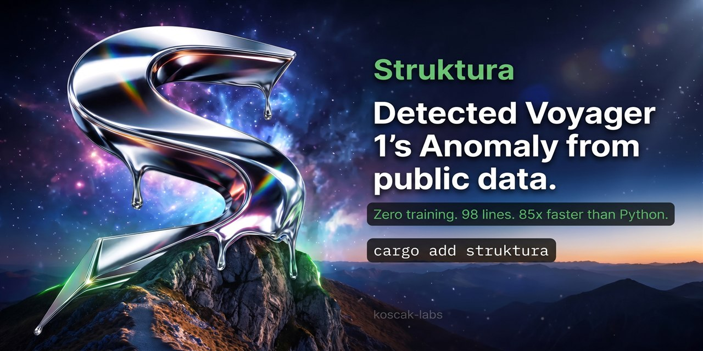
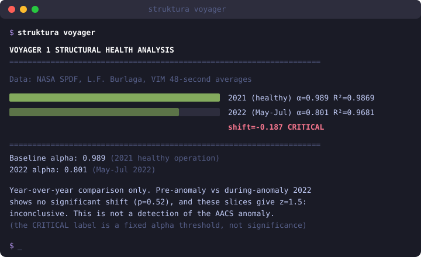

<p align="center">
  
</p>

# struktura

**Time-series anomaly detection for Rust that needs no training data.** Pipe in a CSV, get an exit code. Under the hood: detrended fluctuation analysis (DFA, the Hurst-exponent family), a streaming multi-detector monitor that calibrates itself on your first rows, and a code generator that emits dependency-free C99 for embedded and flight software.

<p align="center">
  <a href="https://crates.io/crates/struktura"></a>
  <a href="https://github.com/koscak-labs/struktura/actions/workflows/ci.yml"></a>
  <a href="https://github.com/koscak-labs/struktura"></a>
  <a href="https://docs.rs/struktura"></a>
</p>

<p align="center"><b>▶ <a href="https://koscak-labs.github.io/struktura/playground/">Try it in your browser</a></b>: the real monitor compiled to WebAssembly (76 KB), next to a limit check on the same stream. Or paste your own data.</p>

---

## ⚡ Quick start

```
$ cargo install struktura
<!-- example:guard-sylv-spike -->
$ struktura guard data/sylv_spike.csv
struktura guard: 1000 samples x 1 channels, calibrated on 333 rows
  note: 333 calibration rows is short; use --baseline 768 or more if the data allows (fewer raises level-shift false alarms)
  row    500  ⚠ ch0 (4.6x threshold): the signal keeps deviating from what its baseline predicts (a step, a drift, or a change in its pattern)
  row    551  ⚠ ch0 (1.7x threshold): the signal's pattern is changing slowly (structural drift)
  2 faults detected across 667 samples (0 adaptations, 0 quarantines)
$ echo $?
1
<!-- /example -->
```

Exit code 0 means healthy, 1 means a fault was detected, 2 means an error. `data/sylv_spike.csv` ships in the repo, so you can reproduce this run exactly.

No model is trained: thresholds come from the signal's own first rows. The one exception is the SMAP/MSL benchmark, which fits a closed-form AR predictor per channel on the train split.

## 🔁 GitHub Action

```yaml
- uses: koscak-labs/struktura@v1
  with:
    file: data/telemetry.csv
    fail-on-fault: true
```

The step fails when a fault is detected and writes the report to the job summary. All inputs are in [action.yml](action.yml).

## 🔬 What it catches that a limit check misses

A limit check (alarm when a value leaves a band learned from healthy data) is the default in most monitoring. It is fast when a fault makes values bigger. It is blind when a fault changes how values follow each other while their spread stays the same, and it false-alarms on healthy signals that wander slowly.

Same streams for all three detectors: 30 seeds, 2,000 samples, change at sample 1,000, calibration on the first 768 samples.

| synthetic stream | struktura `guard` | DFA leg alone | limit check (1.5 × p95, 3 in a row) |
|---|---|---|---|
| correlation change, same variance (white → AR 0.9) | **30/30** caught, median 100 samples | 23/30, median 208 | 7/30, median 371 |
| healthy slow wander (AR 0.95), false alarms | **0/30** | 0/30 | 15/30 |
| healthy AR 0.7, false alarms | 0/30 | 0/30 | 4/30 |
| amplitude grows (white → AR 0.9, std ×2.3) | 30/30, median 16 | 23/30 | 30/30, median 48 |
| white noise → random walk | 30/30, median 13 | 28/30 | 30/30, median 17 |

What this does and does not show:

- It is synthetic data. It shows the kind of fault each method can see, not performance on a real system.
- In the first row, `guard` mostly alarms on its residual-CUSUM leg (21 runs), then level shift (6) and DFA (3). DFA alone catches 23/30, more slowly.
- With only 512 calibration samples, `guard`'s level-shift leg raises 3-6/30 false alarms on these clean streams. Calibrate on at least 768 samples.
- Use a limit check and struktura together. They see different things.

Reproduce with `cargo run --release --example structure_vs_amplitude` (0.4 s), or step through the seeds in the [browser playground](https://koscak-labs.github.io/struktura/playground/). The rows are checked in CI ([docs/claims.tsv](docs/claims.tsv)).

## 📈 On real data: the Numenta Anomaly Benchmark

[NAB](https://github.com/numenta/NAB) has 58 real, labelled series: AWS CloudWatch metrics, server CPU and disk, machine temperatures, traffic, ad clicks, tweet volume. Every detector gets the same data and the same rules: thresholds come only from the first 15% of each series (at least 768 rows), never from the labels, and alarms less than 50 samples apart count as one episode.

| detector (116 labelled windows) | windows caught | false alarms | per 1,000 samples | streaming | builds for Cortex-M |
|---|---|---|---|---|---|
| **struktura `guard`** | 36 | **35** | **0.12** | yes | **yes** |
| **struktura `guard --sensitivity high`** | **49** | 48 | 0.16 | yes | **yes** |
| extended-isolation-forest 0.2.3 | 47 | 182 | 0.61 | no (batch) | no |
| limit check (1.5 × p95, 3 in a row) | 48 | 240 | 0.80 | yes | trivial |
| EWMA chart (λ 0.2, 3σ) | 68 | 758 | 2.53 | yes | trivial |
| CUSUM on raw values (k 0.5σ, h 5σ) | 66 | 860 | 2.87 | yes | trivial |
| ankane STL (anomaly_detection 0.4.0) | 69 | 954 | 3.19 | no (batch) | no |
| grafana augurs BOCPD (augurs-changepoint 0.10.2) | 77 | 1,461 | 4.88 | no (batch) | no |

`guard` raises by far the fewest false alarms and, at its default setting, catches the fewest windows. That trade suits paging a person, where false alarms are what gets a monitor switched off. `--sensitivity high` catches as many windows as the limit check (49 vs 48) with a fifth of its false alarms (48 vs 240). That setting was chosen from a sweep of five on this same benchmark, so treat it as optimistic; on clean synthetic slow-wander streams it raises 2-3 false alarms in 30 where the default raises none. If you need to catch every labelled window and can triage many alarms, BOCPD, STL or even an EWMA chart catch more. The isolation forest timed out on 10 of the 58 series (quantized values) and those count as no alarms, so its row understates it. On the clean control series every detector here is silent.

Most of `guard`'s remaining false alarms come from its drift (residual-CUSUM) leg on daily cycles and on flat metrics with occasional spikes. The opt-in `--quiet-drift` changes little (35 → 33 false alarms, 36 → 35 windows).

Reproduce: clone NAB (commit `ea702d7`) and run `NAB_DIR=path/to/NAB cargo run --release --example nab_eval` for `guard` and the limit check (weekly in CI), or `cargo run --release` in [bench/compare](bench/compare/) for every detector above ([RESULTS.md](bench/compare/RESULTS.md)).

## 🛰️ On real satellite telemetry: OPS-SAT-AD

[OPS-SAT-AD](https://doi.org/10.5281/zenodo.12588359) is telemetry from ESA's OPS-SAT satellite, cut into 2,123 segments that KP Labs labelled nominal or anomalous. Scoring each test segment by how far its `dfa_short` α sits from the median of its channel's nominal training segments gives **AUC-ROC 0.943** (AUC-PR 0.882) on the 529 test segments. Shuffling the values inside each segment drops that to 0.554, so the score comes from the order of the samples, not their spread or count (segment length alone: 0.734; log variance: 0.590). On segments shorter than 64 samples the shuffled control still reaches 0.743, so there only part of the signal is structure.

Two limits: this is segment classification (one score per labelled segment), not the streaming `guard`; and the nominal reference per channel comes from the training labels, so it is not fully unsupervised. Details: [docs/scoreboard/opssat.md](docs/scoreboard/opssat.md). Reproduce with `OPSSAT_DIR=path/to/data cargo run --release --example opssat_eval` (weekly in CI, data pinned by SHA-256).

## 🎯 Who it is for

You have a time series and no labelled faults to train on:

- **Spacecraft and satellite telemetry**: reaction wheels, magnetometers, batteries. Evaluated on NASA SMAP/MSL and ESA OPS-SAT-AD data.
- **Predictive maintenance and bearing fault detection**: vibration from rotating machinery (CWRU and NASA IMS datasets).
- **DevOps metrics**: latency, error rate, throughput drift, piped from stdin.
- **Heart-rate variability**: DFA α on RR intervals, the metric used in HRV research.
- **Embedded `no_std` monitors**: a zero-allocation C99 monitor in about 5.9 KB of RAM. It has no DFA leg; it uses AR(1) prediction residuals, stuck-value and rolling-mean shift detectors.

The monitor calibrates itself, quarantines dead sensors, re-learns its baseline when the environment changes (and rolls back if the "change" turns out to be a fault), and describes each event in plain English. The core has one required dependency (`libm`) and builds for `no_std` + `alloc`; CI builds an external consumer of the packaged crate on `thumbv7em-none-eabihf` with its own allocator and panic handler (logs in [docs/evidence](docs/evidence/)). This has been fixed since 1.7.3; 1.7.2 did not build for `default-features = false` dependents.

It started while contributing to [NASA F´](https://github.com/nasa/fprime). Every number below has the exact command that produced it in [REPRODUCIBILITY.md](REPRODUCIBILITY.md).

<p align="center">
  
</p>

## 📋 Use cases

| you have | you run | you get |
|---|---|---|
| server metrics CSV | `struktura guard metrics.csv` | alerts with the observed/threshold ratio, e.g. "(4.6x threshold)" |
| "when did performance change?" | `struktura when latency.csv` | the sample index and z-score of each structural shift, or "no structural changes detected" (needs at least 6144 samples) |
| two datasets to compare | `struktura compare before.csv after.csv` | the α shift, each signal's spread, and a z-score; z ≥ 3 means the shift is outside both signals' own variability, lower z is inconclusive |
| factory sensor log | `struktura guard --watch machine.csv` | continuous monitoring that adapts to regime changes |
| healthy baseline to certify | `struktura stamp baseline.csv` | a CSV that carries its own fingerprint |
| rover, IoT or embedded target | `struktura generate --rover` | zero-alloc C99 monitor, about 5.9 KB RAM, no DFA leg |

## 🤖 Multi-channel monitoring with sensor quarantine

`struktura guard` detects faults and also acts on them:

```
<!-- example:guard-rover -->
$ struktura guard examples/rover.csv --baseline 1000
struktura guard: 3000 samples x 5 channels (motor_current_A, wheel_rpm, imu_accel_g, battery_soc, temp_motor_C), calibrated on 1000 rows
  row   1644  ⚠ wheel_rpm (1.3x threshold): the signal's behavior changed and predictions are failing
  row   1715  ⚠ imu_accel_g (1.1x threshold): the signal keeps deviating from what its baseline predicts (a step, a drift, or a change in its pattern)
  row   1725  ⚠ imu_accel_g (1.2x threshold): the signal shifted to a new operating level
  row   1725  ↻ environment may have changed, learning new baseline...
  row   2200  ✗ not a real environment change, fault confirmed
  row   2201  ⚠ motor_current_A (15.1x threshold): the signal keeps deviating from what its baseline predicts (a step, a drift, or a change in its pattern)
  row   2211  ⚠ motor_current_A (1.7x threshold): this channel disagrees with what the other channels' physics says it should be
  row   2211  ✗ motor_current_A declared dead, using reconstructed values
  row   2215  ⚠ wheel_rpm (2.0x threshold): the signal's behavior changed and predictions are failing
  6 faults detected across 2000 samples (0 adaptations, 1 quarantines)
<!-- /example -->
```

That is the full output; `examples/rover.csv` is a simulated rover with scripted faults and ships in the repo.

A dead sensor is quarantined and its value reconstructed from the other channels (R² > 0.9). A permanent environment change is re-learned through a guarded candidate baseline, which is rolled back if the new regime is really a fault. Drift that looks like a regime change is refused.

## 🧬 Detectors found by search

`struktura evolve` runs an adversarial loop. RED generates faults the monitor misses; BLUE composes new detector legs from a small grammar and keeps one only if it raises zero alarms on clean data.

| generation | coverage of RED's 100 synthetic probes | detector legs |
|---|---|---|
| 1 | 71% | 2 |
| 4 | 89% | 5 |
| 9 | 97% (peak) | 6 |
| 10 (final) | 92% | 6 |

The six legs it kept include variance, residual-trend and derivative-volatility monitors that were not written by hand. Parameter tuning alone (`struktura redblue`, below) stops at 75%. Faults are synthetic, and the zero-clean-alarm check uses 12 clean seeds. Re-run on 2026-09-24 with `struktura evolve`.

## 🛡️ Validation

- **Hybrid monitor, 7 fault types** (packet loss, spike, stuck, drift, regime shift, mixed, correlation change): all 7 detected. DFA catches the structural faults and the residual legs catch the value faults; neither covers all 7 alone. On one synthetic 200,000-sample 6-channel stream (`struktura monitor-perf`, one fixed seed, thresholds calibrated on a separate 2,048-sample stream) it raised no alarms. That is an observation on one stream, not a false-alarm rate, and no confidence bound is claimed because alarm decisions over overlapping windows are not independent. Output: [docs/evidence/monitor-perf-2026-09-17.md](docs/evidence/monitor-perf-2026-09-17.md).
- **`struktura when` controls**: no changes reported on four stationary controls (shuffled, AR 0.7, AR 0.95, 1/f noise, 123K samples each). The white|walk|white positive control lands at exactly 8192 and 16384.
- **NASA IMS bearing run-to-failure**: alarm at recording 970 of 984, about 2 h before the test ended (α goes from 0.17 to 0.53). A plain RMS amplitude threshold trips earlier on the same bearing, so this is not an early-warning result.
- **Generated C99** compiles under `-Wall -Werror`. `struktura generate-hybrid` bakes your calibration into a dependency-free monitor whose self-test detects a stuck sensor. It is not mission-qualified.

Each item has its command in [REPRODUCIBILITY.md](REPRODUCIBILITY.md).

## 🏎️ Speed

Timings depend on the machine and are not fixture-checked, so treat them as indicative.

| signal size | struktura (Rust, measured) | Python `nolds` (published figure, not run here) | ratio |
|---|---|---|---|
| 4,096 pts | **0.24 ms** | ~15-25 ms | ~85x |
| 16,384 pts | **0.93 ms** | ~60-100 ms | ~86x |
| 65,536 pts | **2.89 ms** | ~250-400 ms | ~112x |

At 0.24 ms per 4,096-point analysis, one core can re-analyse about 4,000 channels of 1 Hz telemetry every second. Reproduce with `cargo run --release --example speed_bench`.

## 🏆 Compared with other detectors

Against [ankane/AnomalyDetection.rs](https://github.com/ankane/AnomalyDetection.rs) (STL decomposition) and a 3σ threshold:

| dataset | struktura | ankane (STL) | threshold (3σ) |
|---------|-----------|-------------|----------------|
| **IMS bearing failure** (NASA) | yes, 46 μs | yes, 696 μs | yes |
| **Voyager heliopause** (NASA) | α 1.137 → 1.056, z = 0.6, inconclusive | no | yes |
| **synthetic correlation shift** | no | no | no |

All three catch the IMS failure; struktura is about 15x faster than STL there. On the bundled heliopause slices (3,988 and 4,404 rows) the α shift of -0.081 has z = 0.6, so it is not a detection; a longer window is the open test. None of the three detects the synthetic correlation change through the simple API. The threshold is fastest but sees only amplitude.

DFA reacts when the correlation structure of a signal changes, not when values leave a band, so use it next to an amplitude check rather than instead of one. Reproduce with `cargo run --release --example comparison`.

## 🦀 Library

```rust
use struktura::{analyze, health_check, HealthVerdict};

let law = analyze(&sensor_data);
let verdict = health_check(&law, baseline_alpha);
// Healthy | Watch | Warning | Critical
```

Streaming:

```rust
use struktura::BaselineTracker;

let mut monitor = BaselineTracker::new(256, 1000);
for sample in telemetry_stream {
    if let Some(verdict) = monitor.push(sample) {
        match verdict {
            HealthVerdict::Critical => trigger_alert(),
            _ => {}
        }
    }
}
```

Spacecraft subsystems:

```rust
use struktura::space::{SpacecraftMonitor, Subsystem};

let mut rwa = SpacecraftMonitor::new(Subsystem::ReactionWheel, "RWA_current");
// push samples, get verdicts
```

`dfa_into()` writes into a caller-supplied buffer, and `dfa_scratch(&[f64], &mut [f64])` does not allocate.

**On a microcontroller (emulated).** The C99 monitor from `struktura generate-hybrid` was built bare-metal for an ARM Cortex-M3 (no FPU) and run in QEMU (`mps2-an385`). On a 3,000-sample, 6-channel stream with a stuck sensor injected at sample 1,500, it alarms at sample 1,504 on the stuck-value leg, the same sample and leg as the Rust monitor and as the same C built for x86, and identically on repeated runs. It uses 7,120 bytes of flash and 9,520 bytes of RAM, with no heap (`malloc`/`free` absent; links with `-nostdlib`). What is not shown yet: it has not run on physical hardware; cycle counts are not measured (QEMU does not model them); `-O2` currently faults in this bare-metal setup, so the ARM numbers use `-O1`; and the C covers 5 of the Rust monitor's 7 legs (no missingness or parity). **Fixed on master, ships in 1.8.5:** in 1.8.4 the generated C computed DFA with box sizes 16..23 while the Rust calibration uses 16..24, so the C DFA leg's α differed from Rust's by 0.1-0.2 on average (worst 0.85). Both now take their box sizes from one function (`dfa_box_sizes`), and a test checks that the generated C's α matches Rust's (tests/hybrid_c_matches_rust.rs). The QEMU equivalence above was measured before this fix and covers the stuck-value leg only. Reproduce with [bench/flight/run.sh](bench/flight/) in WSL/Linux.

## 📊 Measured α on bundled data

| domain | signal | baseline α | comparison α | shift | what it shows |
|--------|--------|-----------|---------|-------|---------|
| **bearings** | CWRU 12 kHz vibration, normal vs inner-race fault | 0.689 | 0.183 | -0.506 | clear separation (`struktura demo`) |
| **spacecraft** | Voyager 1 magnetometer, 2021 vs 2022 slices (not the AACS anomaly window) | 0.989 | 0.801 | -0.187 | z = 1.5, inconclusive (`struktura voyager`) |
| **ESA satellites** | ESA-ADB Mission 1 | | | | adapter built ([esa-adb/](esa-adb/struktura-dfa/)); scores pending an official benchmark run |
| **text** | shuffled Austen sentence lengths | | 0.573 | | α only; the unshuffled original is not shipped |
| **genome** | human chr1 GC% | 0.909 | | | α only, R² = 0.991 |
| **cardiac** | HRV RR intervals, synthetic by default (`examples/cardiac_hrv.rs`) | 0.695 | | | α only, R² = 0.985 |

Only the bearing row is a normal-vs-fault separation on real data. The CRITICAL label from `check` and `compare` is a fixed α threshold, not a significance test. More domains, with citations, in [USE_CASES.md](USE_CASES.md).

## 🪐 NASA SMAP/MSL benchmark

The SMAP/MSL telemetry benchmark has 82 labelled anomaly channels from the Curiosity rover and the SMAP soil-moisture satellite. A per-channel AR predictor is fitted by closed-form ridge least squares on the train split (no gradient descent, no GPU), with no tuning.

```
<!-- example:smap -->
$ struktura smap --ar 0 --dfa

  NASA SMAP + MSL/CURIOSITY ANOMALY BENCHMARK
  Real spacecraft telemetry, JPL-labeled anomalies (telemanom dataset).
  Protocol: calibrate on the nominal train split, stream the test
  split; a labeled sequence is DETECTED if any alarm lands inside it;
  alarms outside every labeled sequence count as false positives.
  ================================================================

  | Spacecraft | Channels | Sequences | Detected | FP alarms | Precision | Recall |
  |------------|----------|-----------|----------|-----------|-----------|--------|
  | SMAP       |   54 (1sk) |        69 |       42 |         5 |     89.4% |  60.9% |
  | MSL        |   26 (1sk) |        36 |       16 |         9 |     64.0% |  44.4% |
  |------------|----------|-----------|----------|-----------|-----------|--------|
  | TOTAL      |          |       105 |       58 |        14 |     80.6% |  55.2% |

  Overall F1: 0.655   (JPL telemanom LSTM, same data: P=87.5% R=80.0%)
  Recall by anomaly class:
    [contextual]   9/17  =  52.9%
    [point]       38/45  =  84.4%
    contextual]"   8/30  =  26.7%
    point]"        3/11  =  27.3%
  Self-calibrated, no training, no GPU, ~4us/sample. Note: the values are
  pre-scaled to (-1,1) by JPL and many channels saturate, which auto-disables
  the repeated-value leg on those channels.

<!-- /example -->
```

F1 0.655 with `--ar 0 --dfa` (precision 0.806, recall 0.552) is the best configuration measured. Plain `struktura smap` scores 0.161, because its default residual leg raises 419 false alarms on JPL's pre-scaled channels. Both are well below the JPL telemanom LSTM on the same data (P = 87.5%, R = 80.0%), so this crate does not compete with supervised models on SMAP/MSL. What it offers is no training and no GPU. Scoring is point-adjusted: any alarm inside a labelled window counts as a hit. An F1 of 0.788 quoted in earlier versions could not be reproduced ([docs/evidence/smap-f1-2026-09-17.md](docs/evidence/smap-f1-2026-09-17.md)). The block above is generated from `docs/examples/smap.cmd` and checked in CI.

## 📖 Text rhythm

Sentence lengths in prose have long-range correlations that disappear when the sentences are shuffled. DFA measures that.

```
<!-- example:text -->
$ struktura text data/austen_shuffled.txt data/mechanical_text.txt

  TEXT STRUCTURE ANALYSIS
  DFA on sentence-length sequences, measures writing rhythm
  ====================================================================

  Reference: human prose α≈0.7-0.8 | shuffled/mechanical α≈0.5

  #################............. data/austen_shuffled.txt
                                 sentences=18049  mean_len=124  α=0.573  R²=0.9851
                                 MODERATE RHYTHM

  ################.............. data/mechanical_text.txt
                                 sentences=1000  mean_len=58  α=0.525  R²=0.9757
                                 UNIFORM/MECHANICAL

  ====================================================================
  α > 0.6 = long-range correlations in sentence rhythm (human writing)
  α ≈ 0.5 = random/shuffled/uniform sentence lengths
<!-- /example -->
```

The repo ships a shuffled Austen corpus and a mechanical one, but not the unshuffled original, so only these two are shown. Reproduce with `docs/examples/text.cmd`.

## 🛰️ Spacecraft telemetry health monitoring

Built-in subsystem profiles: reaction wheels, magnetometers, batteries, thermal sensors, solar arrays, gyroscopes.

```
<!-- example:spacecraft -->
$ struktura spacecraft

  MULTI-CHANNEL SPACECRAFT HEALTH MONITOR
  DFA structural analysis across 4 telemetry channels
  (RWA/BAT/THM synthetic; MAG = real Voyager 1 data)
  ====================================================================

  ############################## [RWA:RWA_current]
                                 alpha=1.308 baseline=1.193 shift=+0.116 R²=0.9570  WARNING

  ############################## [BAT:BAT_voltage]
                                 alpha=1.980 baseline=1.883 shift=+0.097 R²=0.9993  WARNING

  ############################## [THM:THM_panel_A]
                                 alpha=1.888 baseline=1.815 shift=+0.073 R²=0.9944  WATCH

  ############################## [MAG:MAG_B_total]
                                 alpha=1.030 baseline=0.878 shift=+0.152 R²=0.9903  CRITICAL

  ====================================================================
  Each channel: first half = baseline, second half = current period.
  DFA reads structure, not level: the mean can look normal while
  alpha shifts. Whether that shift is a fault needs a control run.
<!-- /example -->
```

RWA, BAT and THM are synthetic; MAG is real Voyager 1 magnetometer data. The fixture is `docs/examples/spacecraft.cmd`.

## 🏗️ Flight software code generation

Generate monitoring apps for NASA cFS, F´ and ROS:

```
struktura generate --cfs    --db channels.json -o dfa_cfs_app/
struktura generate --fprime --db channels.json -o dfa_fprime_component/
struktura generate --ros    --db channels.json -o dfa_ros_node/
```

`channels.json` uses the [nasa/ogma](https://github.com/nasa/ogma) variable database format.

**Generated DFA matches the Rust library from 1.8.5.** Up to 1.8.4, `struktura codegen` and `generate --cfs` computed α on their ring buffer in storage order once it had wrapped, and `struktura codegen` and `generate-hybrid` used different box sizes from Rust (α off by up to 0.76 against Rust `dfa()`). Found by differential tests; fixed with every generator taking its box sizes from `dfa_box_sizes` and unrolling the ring into time order. Tests check the generated C against Rust after every sample (tests/c_monitor_matches_rust.rs, tests/hybrid_c_matches_rust.rs). `generate --fprime` and `generate --rover` were not affected. If you generated DFA monitors with 1.8.4 or earlier, regenerate them.

## 🧠 How DFA works (Hurst exponent in Rust)

DFA (Peng et al., Physical Review E, 1994) measures long-range correlation:

1. Compute the cumulative profile (running sum minus the mean).
2. Split it into boxes and detrend each box with a linear fit.
3. Measure the residual fluctuation as a function of box size.
4. The slope in log-log space is α, the scaling exponent.

| α | meaning |
|---|---------|
| ~0.5 | uncorrelated noise |
| 0.5-1.0 | persistent long-range correlation |
| a shift in α | the process generating the signal changed |

Every α comes with its R². Below R² = 0.3 the quality is reported as `Abstain` instead of a verdict.

## ⚔️ Policy search (RED/BLUE)

`struktura redblue` tunes the detection policy. RED probes for faults the current configuration misses; BLUE mutates the policy and keeps a change only if it raises zero alarms on clean data.

```
<!-- example:redblue -->
$ struktura redblue

  RED/BLUE ADVERSARIAL SELF-IMPROVEMENT
  RED probes the continuous fault space for misses; BLUE evolves the
  detection policy against the accumulated miss corpus under a
  ZERO-clean-alarm law. 6 rounds x 120 probes x 10 mutations.
  ================================================================

  | Round | RED coverage | New misses | Corpus cov. after BLUE | Evolved? |
  |-------|--------------|------------|------------------------|----------|
  |     1 |    60.0%     |         48 |              16.7%     | YES |
  |     2 |    70.8%     |         35 |              21.7%     | YES |
  |     3 |    68.3%     |         38 |              15.7%     | YES |
  |     4 |    74.2%     |         31 |              10.7%     | YES |
  |     5 |    64.2%     |         43 |               3.6%     |       no |
  |     6 |    75.0%     |         30 |               0.7%     |       no |

  RED coverage: 60.0% (round 1) -> 75.0% (round 6)
  Evolved config: res_span=20 dfa_persist=2 roll_persist=7 cusum_k=1.00 horizon=147553
  Zero-clean-alarm law verified on every accepted mutation.
<!-- /example -->
```

The run is deterministic (seeded; two runs gave byte-identical output) and takes about 100 s.

## 🎮 Commands

| command | what it does |
|---------|-------------|
| `guard <file>` | multi-detector monitor with self-calibration, quarantine and guarded re-learning |
| `when <file>` | changepoint detection: where the structure changed |
| `check <file>` | one-shot DFA analysis |
| `prove <file>` | bootstrap CI on α plus a shuffle test for structure |
| `compare <a> <b>` | α shift between two signals, with a z-score |
| `scan <file>` | auto-classify, trend and health in one pass |
| `demo` | bearing fault on CWRU data |
| `voyager` | Voyager 1 magnetometer, 2021 vs 2022 |
| `smap` | NASA SMAP/MSL benchmark |
| `spacecraft` | multi-channel spacecraft health monitor |
| `text <file>` | sentence-rhythm analysis |
| `market <file>` | regime detection on prices |
| `rhythm <file>` | event timing (commits, heartbeats) |
| `redblue`, `evolve` | policy and detector search |
| `generate` | C99 / cFS / F´ / ROS code generation |
| `pipe` | streaming DFA from stdin (Prometheus, MQTT, tail) |

`struktura --help` lists everything.

## 🐳 Docker, Python, shell

```bash
# docker
docker build -t struktura . && docker run -v ./data:/data struktura guard /data/sensor.csv

# python (wheels for Linux, macOS, Windows; PyPI coming)
pip install struktura --find-links https://github.com/koscak-labs/struktura/releases/expanded_assets/py-v1.8.6
python -c "import struktura, random; print(struktura.dfa_short([random.random() for _ in range(70)]).alpha)"

# javascript / node (WebAssembly; a browser build is attached to the same release)
npm install https://github.com/koscak-labs/struktura/releases/download/wasm-v1.8.6/struktura-1.8.6.tgz
node -e "const s=require('struktura'); console.log(s.dfaShort(Float64Array.from({length:70},Math.random)).alpha)"

# stream anything through DFA
tail -f /var/log/metrics.csv | struktura pipe --json
curl prometheus:9090/query | struktura pipe --window 128

# cron job with a Slack webhook
*/5 * * * * struktura guard /data/sensor.csv --webhook $SLACK_URL
```

More in `examples/devops_integration.sh`.

## ⚠️ Limitations

- **DFA sees structural shifts, not point anomalies.** A single spike barely moves α; pair DFA with a residual detector for spikes and outliers (`guard` already does).
- **Daily cycles and flat, spiky metrics cause most false alarms on real data** (NAB). `--quiet-drift` barely changes that (35 → 33). There is no seasonal model yet: an attempt to learn daily shapes from the calibration window made NAB results worse and was not shipped.
- **guard assumes its calibration rows are healthy.** By default that is the first third of the file; a fault inside it becomes "normal". On NAB's machine-temperature failure series the default calibration spans a labelled failure and guard alone reported the series healthy. guard now checks this: it calibrates on the first half of the calibration rows and warns if the second half already alarms. On NAB, with the default calibration, the warning fired on 6 of the 10 series whose calibration contains a labelled anomaly and on 2 of the 8 whose calibration is clean; it is skipped when calibration is under 1,536 rows (40 series). On clean synthetic streams it fired on 1 of 90. When you know a healthy stretch, pass `--baseline N`. (`cargo run --release --example calib_selfcheck_eval`)
- **Short calibration raises false alarms.** With 512 calibration samples the level-shift leg raised 3-6/30 false alarms on clean synthetic streams; from 768 samples on it raised none (`CALIB=512 cargo run --release --example structure_vs_amplitude`).
- **Preprocessing changes α.** A new filter upstream (notch, bandpass, artifact rejection) invalidates the baseline; recalibrate after any change ([#8](https://github.com/koscak-labs/struktura/issues/8)).
- **α alone is not a decision.** The `HealthVerdict` thresholds (0.03 / 0.08 / 0.15) are defaults, not universal constants.
- **F1 on SMAP/MSL is 0.655.** Supervised models do better. The case for this crate is no training, speed and embedded use.

## 🧰 Features

- box sizes spaced geometrically to the signal length
- `no_std` + `alloc` with `default-features = false`
- C FFI via `struktura.h`
- optional `serde`
- `struktura self-test` re-runs the built-in checks

## 🔍 Alternatives

| crate | DFA | license | deps | `no_std` |
|-------|-----|---------|------|---------|
| **struktura** | yes | MIT/Apache-2.0 | 1 (`libm`) | yes (+ alloc) |
| anomaly_detection | no | GPL-3.0 | several | no |
| extended-isolation-forest | no | MIT | several | no |

## 📚 References

1. C.-K. Peng et al., "Mosaic organization of DNA nucleotide sequences," Physical Review E 49(2), 1994.
2. C.-K. Peng et al., "Quantification of scaling exponents," Chaos 5(1), 1995.
3. CWRU Bearing Data Center: https://engineering.case.edu/bearingdatacenter
4. NASA SPDF Voyager Data: https://spdf.gsfc.nasa.gov/pub/data/voyager/

## 📄 License

MIT OR Apache-2.0. Issues and pull requests are welcome.
